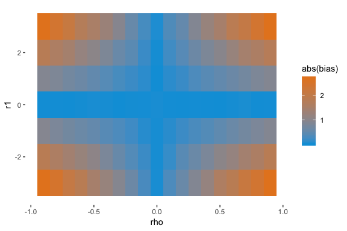
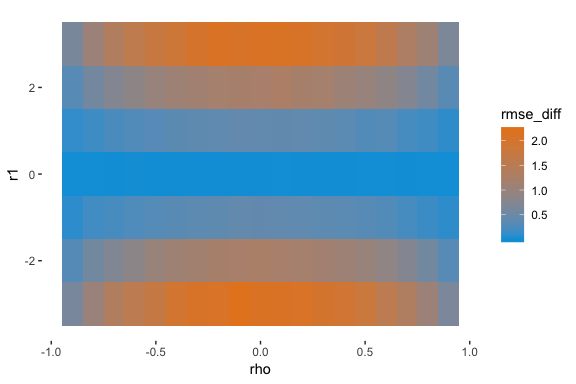

Correlation of Omitted Variable and Regressor
================

Motivation
----------

This project is motivated by a discussion at work. In econometrics class, the omitted variable problem is usually treated in the context of how the omitted variable biases the estimate of the treatment variable. In the industry context, we normally deal with problems that arise in the context of the prediciton accuracy. Therefore, omitted variable bias is more often than not discussed in the context of the bias in the estimates, while omitted variable bias is seldom discussed in the context of the prediction accuracy.

Omitted Variable Bias
---------------------

The key results in the econometrics textbook can be applied from a different aspect.

Let the true model be:

*y* = *X**β* + *Z**γ* + *ϵ*

and we run a regression of

*y* = *X**β* + *u*

This is a standard omitted variable setup.

The well-known result derived from this setup is:

*b* = *β* + (*X*′*X*)<sup>−1</sup>(*X*′*Z**γ*)+(*X*′*X*)<sup>−1</sup>*X*′*ϵ*

*E*(*b*|*X*, *Z*)=*β* + *E*\[*x*<sub>*i*</sub>*x*<sub>*i*</sub>′\]<sup>−1</sup>*E*(*x*<sub>*i*</sub>*z*<sub>*i*</sub>′)*γ*

When *z*<sub>*i*</sub> is a scalar, the bias of *b* is *c**o**v*(*x*<sub>*i*</sub>, *z*<sub>*i*</sub>)/*v**a**r*(*x*<sub>*i*</sub>).

This result says that the higher the correlation between *Z* and *X*, the larger the bias of *b*. And the more important *Z* is in the true regression, the more biased is *b*.

Prediction Accuracy
-------------------

Another well-known result is that when we look at the residual sum of squares:

The residuals of the true model are defined as

*u* = *y* − *X**b*<sub>0</sub> − *Z**r*<sub>0</sub>;

the residuals of the model omitting *Z* are defined as

*e* = *y* − *X**b*:

*e*′*e* = *u*′*u* + *r*<sub>0</sub><sup>2</sup>*z* \* ′*z*\*

where

*z* \* =*M*<sub>*x*</sub>*z* = *z* − *X*(*X*′*X*)<sup>−1</sup>*X*′*z*,

that is, the residuals from regressing *z* against *X*. Two factors play a role in this theorem:

1.  The magnitude of *γ* in the true model: The more influential *z* is on *y*, the larger the extent to which the "wrong" model deteriotes from the true model.

2.  The correlation between *z* and *X*: The larger the correlation between *z* and *X*, the smaller *z* \* ′*z*\* is; and, therefore, the smaller the extent to which the "wrong" model deteriorates from the true model.

Monte Carlo Simulation
----------------------

I set up a Monte Carlo simulation to confirm our theoretical derivation. Let the truth be:

*y*<sub>*i*</sub> = 1 + ( − 2)⋅*x*<sub>*i*</sub> + *r*<sub>1</sub> ⋅ *z*<sub>*i*</sub> + *ϵ*<sub>*i*</sub>,

where *x*<sub>*i*</sub> and *z*<sub>*i*</sub> are bivariate normal with zero mean, unit variance, and correlation of *ρ*.

I then vary the values for *ρ* and *r*<sub>1</sub>.

``` r
set.seed(42)
n = 100 # sample size
sim = 50 # number of simulations
# ==============
mu_x <- 1
sigma_x <- 1
mu_z <- 1
sigma_z <- 1
# ==============
b0 <- 1
b1 <- -2
# ==============
rho_list <- seq(-0.9, 0.9,0.1)
r1_list <- c(-3, -2, -1, 0, 1, 2, 3)
out <- NULL
for(rho in rho_list) {
    for(r1 in r1_list) {
        bias <- numeric(sim) # bias based on empirical data
        rmse <- numeric(sim) # rmse by true model
        rmse_ov <- numeric(sim) # rmse without z
        for(i in 1:sim){
             x <- rnorm(n, mu_x, sigma_x)
             z <- rnorm(n, mu_z + sigma_z/sigma_x * rho *(x - mu_x), sqrt((1- rho^2) * sigma_z^2))
             y <- rnorm(n, b0 + b1 * x + r1 * z, 1)
             fit <- lm(y ~ x)
             true <- lm(y ~ x + z)
             bias[i] <- coef(fit)['x'] - b1
             rmse[i] <- sqrt(mean((y - fitted(true))^2))
             rmse_ov[i] <- sqrt(mean((y - fitted(fit))^2))
        } 
        res <- data.frame(rho = rho, r1 = r1, bias = mean(bias), rmse_diff = mean(rmse_ov - rmse))
        out <- rbind(out, res)
    }
}
```

The following grpahic confirms that the larger the correlation the larger the bias; and the more important a role *Z* plays in the true regression, the larger the bias.

``` r
ggplot(out, aes(x = rho, y = r1, fill = abs(bias))) + geom_tile() + 
    scale_fill_gradient(low = "#00a0dc", high = "#e68523") + theme(
    panel.background = element_blank()
)
```



The following graphic shows that given the value of *r*<sub>1</sub>, the larger the correlation, the smaller the difference is the root mean squared error of the wrong model from the true model. On the other hand, given the value of *ρ*, the smaller *r*<sub>1</sub> is, the smaller the deterioration in performance of the wrong model.

``` r
ggplot(out, aes(x = rho, y = r1, fill = rmse_diff)) + geom_tile() + 
    scale_fill_gradient(low = "#00a0dc", high = "#e68523") + theme(
    panel.background = element_blank()
)
```



Concluding Remarks
------------------

This result is somewhat surpirsing at the first sight. When *ρ* and *r*<sub>1</sub> are more correlated, *b* of the model without *Z* is more biased, but the model performance in terms of prediction accuracy deteriorates less.

However, the results make sense when you think about it. When *X* and *Z* are highly correlated, the coefficient of *X*, *b*, will pick up more influence of *Z* and, therefore, is more biased. However, since *b* picks up more influence of *Z*, the predictions are closer to the one using the true model and, therefore, the RMSE deteriorates less.
